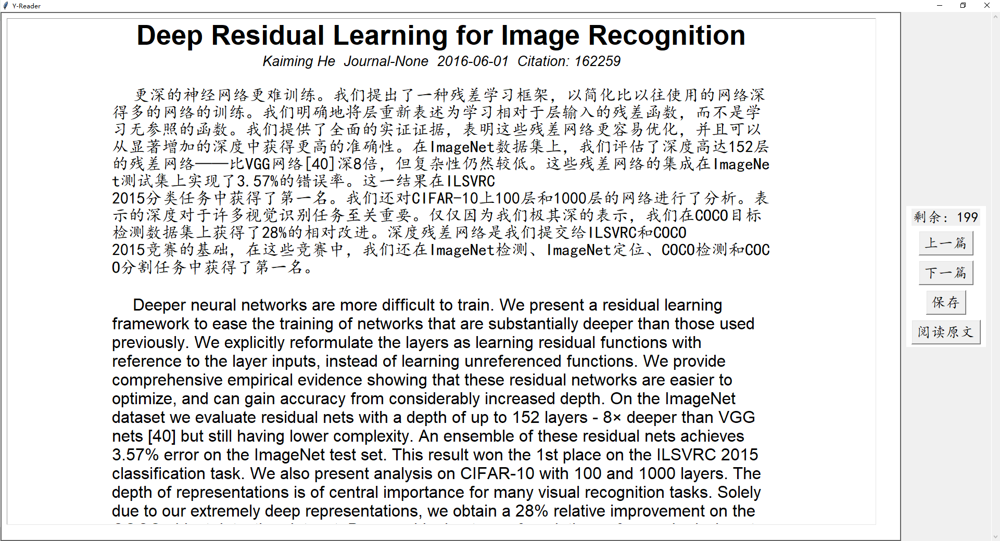

# Yesearcher科研助手
关键字搜索，批量阅读摘要，保存论文。

**基于**

- pyalex：检索论文
- 智谱AI：翻译
- tkinter：可视化界面
- pyzotero：保存论文至 zotero


## 介绍

使用 Yesearcher 寻找，过滤论文

```python
# main.py

keywords = '"residual learning" OR "image recognition"' # 关键词
w.filter(title={"search":keywords}) # 关键词检索
filter_recent_n_years(keywords, 10) # 过滤近n年的文献
# w = Works().filter(from_publication_date="2015-07-01", to_publication_date="2017-07-31") # 按日期过滤
# filter_from_month(keywords, 2024, 1) # 过滤2024年1月之后的文献
```


使用 Yesearcher 阅读论文摘要 (最多显示200篇):


使用 "保存" 按钮可将论文保存至 zotero 的对应文件夹中

## 配置
配置METADATA.py
```python
# zotero 配置
ZOTERO_API_KEY = 'xxx' 
LIBRARY_ID = 'xxx'
LIBRARY_TYPE = 'user'
COLLECTION_KEY = 'xxx'
# 智谱AI配置
ZHIPU_KEY = "x.xxx"
```
运行
```bash
python main.py
```

## 更新
### v0.2 一键可视化，新增翻译功能 2024-09-09
- 将搜索器和查看器集成，一键可直达
- 设计filter_from_month，用于过滤从某月至今的文献
- 设计filter_recent_n_years，用于展示最近n年的文献
- 添加翻译功能，采用openglm接口
- 将翻译过的摘要放入数据库中

### v0.1 完成了基本功能 2024-08-18
- 论文检索（使用pyalex）
- 生成xml文件（最多两百篇）
- 使用tkinter可视化论文信息
- 制作了四个按钮，用于查看论文信息，阅读原文，以及保存至zotero指定文件夹")
- 论文检索（使用pyalex） - 生成xml文件（最多两百篇） - 使用tkinter可视化论文信息 - 制作了四个按钮，用于查看论文信息，阅读原文，以及保存至zotero指定文件夹


## TODO

- 解决 某些会议不显示 的问题
- 尝试扩容，200篇对于长时间区间检索有些不够用
